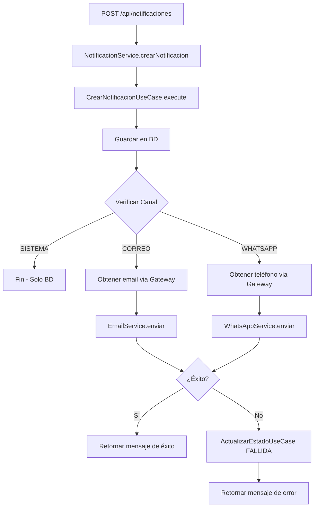

# Módulo de Notificaciones - Sistema Multi-Canal

## 📋 Descripción

El módulo de notificaciones ahora soporta **envío multi-canal**: 
- **SISTEMA**: Solo se guarda en la base de datos (notificaciones internas)
- **CORREO**: Se guarda en BD y se envía por email usando JavaMailSender
- **WHATSAPP**: Se guarda en BD y se envía por WhatsApp usando Twilio API

## 🏗️ Arquitectura

El módulo sigue el patrón **Hexagonal (Ports and Adapters)**:

```
module_notificaciones/
├── core/
│   ├── entities/          # Entidades de dominio
│   └── ports/             # Interfaces (puertos)
│       ├── IUsuarioGateway.java
│       ├── IEmailService.java
│       └── IWhatsAppService.java
├── infrastructure/
│   ├── adapters/          # Implementaciones de puertos
│   │   └── UsuarioGatewayAdapter.java
│   └── external/          # Servicios externos
│       ├── EmailServiceImpl.java
│       └── WhatsAppServiceImpl.java
└── services/
    ├── usecases/          # Casos de uso
    └── NotificacionService.java  # Orquestador
```

## ✨ Características

### 1. Persistencia Garantizada
- **SIEMPRE** se guarda primero en la base de datos
- Luego se intenta el envío por el canal especificado

### 2. Manejo de Errores
- Si el envío por email o WhatsApp **falla**, el estado se actualiza a `FALLIDA`
- La notificación queda registrada en BD para auditoría

### 3. Gateway de Usuarios
- Acceso a datos de usuarios sin violar el encapsulamiento de módulos
- Obtiene: correo, teléfono y nombre del usuario

### 4. Configuración Flexible
- Flags para habilitar/deshabilitar servicios (`EMAIL_ENABLED`, `WHATSAPP_ENABLED`)
- Ideal para desarrollo (false) y producción (true)

## 🚀 Configuración

### 1. Variables de Entorno

Crear un archivo `.env` basado en `.env.example`:

```bash
# Email
EMAIL_ENABLED=true
EMAIL_FROM=noreply@sigea.com
EMAIL_NOMBRE_REMITENTE=SIGEA - Sistema de Gestión
EMAIL_HOST=smtp.gmail.com
EMAIL_PORT=587
EMAIL_USERNAME=tu_email@gmail.com
EMAIL_PASSWORD=tu_app_password

# WhatsApp (Twilio)
WHATSAPP_ENABLED=true
TWILIO_ACCOUNT_SID=ACxxxxxxxxxxxxxxxxxxxxx
TWILIO_AUTH_TOKEN=tu_auth_token
TWILIO_WHATSAPP_FROM=whatsapp:+14155238886
```

### 2. Configuración de Gmail

Para usar Gmail con autenticación de 2 factores:

1. Ir a [Google Account](https://myaccount.google.com/)
2. Seguridad → Verificación en dos pasos
3. Contraseñas de aplicaciones
4. Generar contraseña para "Correo" → Copiar el código
5. Usar ese código en `EMAIL_PASSWORD`

### 3. Configuración de Twilio

1. Crear cuenta en [Twilio](https://www.twilio.com/try-twilio)
2. Obtener credenciales en [Console](https://console.twilio.com)
3. Para **pruebas**, usar WhatsApp Sandbox:
   - Ir a Messaging → Try it out → Send a WhatsApp message
   - Enviar mensaje al número sandbox desde tu WhatsApp
   - Usar `whatsapp:+14155238886` como `TWILIO_WHATSAPP_FROM`
4. Para **producción**, solicitar número oficial de WhatsApp Business

## 📝 Uso

### Crear Notificación

**Endpoint**: `POST /api/notificaciones`

```json
{
  "usuarioId": "123e4567-e89b-12d3-a456-426614174000",
  "titulo": "Nueva actividad disponible",
  "mensaje": "Se ha publicado una nueva actividad de voluntariado",
  "tipoNotificacionId": "tipo-uuid",
  "canal": "WHATSAPP"
}
```

**Canales disponibles**:
- `SISTEMA`: Solo guarda en BD
- `CORREO`: Guarda en BD + envía email
- `WHATSAPP`: Guarda en BD + envía WhatsApp

### Respuestas

**Éxito**:
```json
{
  "message": "Notificación creada y enviada con éxito por canal WHATSAPP"
}
```

**Error en envío** (la notificación SE GUARDA pero el envío falla):
```json
{
  "message": "Notificación creada pero el envío por WHATSAPP falló. Estado actualizado a FALLIDA."
}
```

## 🔧 Servicios Implementados

### EmailServiceImpl

- **Tecnología**: JavaMailSender (Spring Boot Mail)
- **Formato**: HTML con estilos CSS embebidos
- **Personalización**: Nombre del usuario en el saludo
- **Fallback**: Texto plano si falla HTML
- **Timeout**: 5 segundos de conexión

**Plantilla HTML**:
```html
<!DOCTYPE html>
<html>
<head>
    <style>
        body { font-family: Arial, sans-serif; }
        .header { background: linear-gradient(135deg, #667eea 0%, #764ba2 100%); }
        .content { background-color: #f9f9f9; padding: 30px; }
    </style>
</head>
<body>
    <div class="header">
        <h1>📬 Nueva Notificación</h1>
    </div>
    <div class="content">
        <p>Hola <strong>${nombreUsuario}</strong>,</p>
        <h2>${titulo}</h2>
        <p>${mensaje}</p>
    </div>
</body>
</html>
```

### WhatsAppServiceImpl

- **Tecnología**: Twilio SDK
- **Formato**: Mensaje de texto con emojis
- **Personalización**: Nombre del usuario
- **Validación**: Verifica configuración antes de enviar

**Formato del mensaje**:
```
📬 *SIGEA - Nueva Notificación*

Hola *${nombreUsuario}*,

📌 *${titulo}*

${mensaje}

---
Este es un mensaje automático del Sistema SIGEA
```

### UsuarioGatewayAdapter

- **Propósito**: Acceso a datos de usuario sin acoplamiento
- **Métodos**:
  - `obtenerCorreoUsuario(String usuarioId)` → Optional<String>
  - `obtenerTelefonoUsuario(String usuarioId)` → Optional<String> (con prefijo +51)
  - `obtenerNombreUsuario(String usuarioId)` → Optional<String>

## 🧪 Testing

### Desarrollo Local (Servicios deshabilitados)

```properties
EMAIL_ENABLED=false
WHATSAPP_ENABLED=false
```

Las notificaciones se guardan pero **NO** se envían.

### Testing Email

1. Usar [Mailtrap](https://mailtrap.io/) para capturar emails sin enviarlos:
```properties
EMAIL_HOST=smtp.mailtrap.io
EMAIL_PORT=2525
EMAIL_USERNAME=tu_username
EMAIL_PASSWORD=tu_password
```

2. Crear notificación con `canal=CORREO`
3. Verificar en inbox de Mailtrap

### Testing WhatsApp

1. Configurar Twilio Sandbox
2. Crear notificación con `canal=WHATSAPP`
3. Verificar mensaje en tu WhatsApp

## 📊 Estados de Notificación

| Estado | Descripción |
|--------|-------------|
| `PENDIENTE` | Notificación creada, esperando procesamiento |
| `ENVIADA` | Enviada correctamente por el canal |
| `FALLIDA` | Error en el envío por WhatsApp/Email |

## 🔒 Seguridad

- ✅ No se exponen credenciales en código
- ✅ Variables de entorno para configuración sensible
- ✅ Timeouts configurados para evitar bloqueos
- ✅ Logging de errores sin exponer datos sensibles
- ✅ Validación de datos antes de enviar

## 📦 Dependencias

**Maven** (`pom.xml`):
```xml
<!-- Spring Boot Mail -->
<dependency>
    <groupId>org.springframework.boot</groupId>
    <artifactId>spring-boot-starter-mail</artifactId>
</dependency>

<!-- Twilio SDK -->
<dependency>
    <groupId>com.twilio.sdk</groupId>
    <artifactId>twilio</artifactId>
    <version>9.14.1</version>
</dependency>
```

## 📖 Flujo de Ejecución



## 🆘 Troubleshooting

### Email no se envía

1. Verificar `EMAIL_ENABLED=true`
2. Comprobar credenciales SMTP
3. Gmail: Usar App Password, no contraseña normal
4. Revisar logs: `ERROR al enviar notificación por email`

### WhatsApp no se envía

1. Verificar `WHATSAPP_ENABLED=true`
2. Comprobar credenciales de Twilio
3. Sandbox: Enviar mensaje de join primero
4. Formato del número: `whatsapp:+51999999999`
5. Revisar logs: `ERROR al enviar notificación por WhatsApp`

### Usuario sin correo/teléfono

- El sistema loguea: `No se encontró correo/teléfono para usuario ID: xxx`
- Estado se actualiza a `FALLIDA`
- Notificación queda en BD para auditoría

## 📝 Logs

**Ejemplo de logs exitosos**:
```
INFO  NotificacionService - Notificación creada con ID: abc-123 para usuario: user-456
INFO  NotificacionService - Intentando enviar notificación abc-123 por WHATSAPP
INFO  WhatsAppServiceImpl - Enviando WhatsApp a +51999999999
INFO  WhatsAppServiceImpl - WhatsApp enviado exitosamente. SID: SMxxxxxxx
INFO  NotificacionService - WhatsApp enviado exitosamente a +51999999999 para notificación ID: abc-123
```

**Ejemplo de logs con error**:
```
INFO  NotificacionService - Notificación creada con ID: abc-123 para usuario: user-456
INFO  NotificacionService - Intentando enviar notificación abc-123 por CORREO
ERROR UsuarioGatewayAdapter - No se encontró correo para usuario ID: user-456
ERROR NotificacionService - No se encontró correo para usuario ID: user-456
INFO  ActualizarEstadoNotificacionUseCase - Estado de notificación abc-123 actualizado a FALLIDA
```

## 🎯 Mejoras Futuras

- [ ] Reintentos automáticos para envíos fallidos
- [ ] Cola de mensajes con RabbitMQ/Kafka
- [ ] Soporte para SMS (Twilio SMS)
- [ ] Plantillas personalizables de email
- [ ] Dashboard de métricas de envíos
- [ ] Webhook de Twilio para confirmaciones de entrega

---

**Autor**: Sistema SIGEA  
**Versión**: 1.0.0  
**Fecha**: 2025
